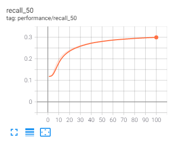

# Collaborative Metric Learning
Pytorch Implementation of 'Collaborative Metric Learning'   
> Cheng-Kang Hsieh, Longqi Yang, Yin Cui, Tsung-Yi Lin, Serge Belongie, and Deborah Estrin. 2017. Collaborative Metric Learning. In Proceedings of the 26th International Conference on World Wide Web (WWW '17). International World Wide Web Conferences Steering Committee, Republic and Canton of Geneva, CHE, 193–201. DOI:https://doi.org/10.1145/3038912.3052639

* [paper](http://www.cs.cornell.edu/~ylongqi/paper/HsiehYCLBE17.pdf)

## Experimental Results
recall@50
  

## References

