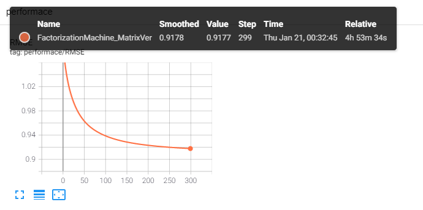
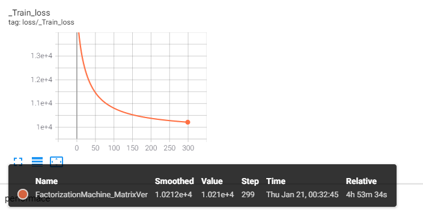

# Wide & Deep Learning for Recommender Systems
Pytorch Implementation of 'Factorization Machine' on Movielens Dataset   
> Rendle, Steffen. "Factorization machines." 2010 IEEE International Conference on Data Mining. IEEE, 2010.

* [paper](https://ieeexplore.ieee.org/document/5694074)

## Experimental Results
Experiments on Movielens dataset  

## Future works
Matrix Factorization using Embedding Layer