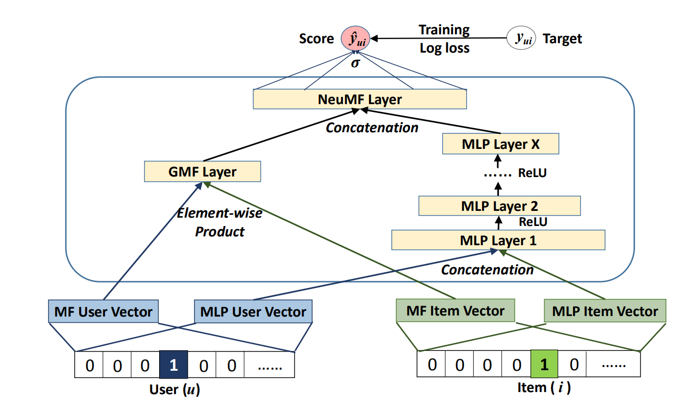
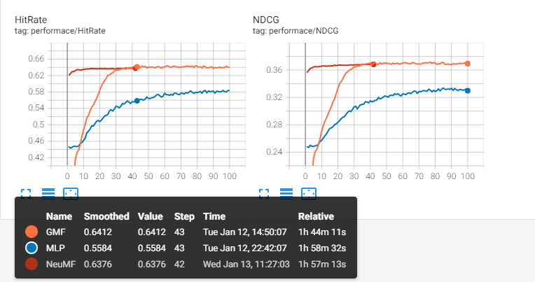

# RecSys_paper
implementation of Recommendation System papers

## Neural Collaborative Filtering
Implementation of 'Neural Collaborative Filtering'   
> He, Xiangnan, et al. "Neural collaborative filtering." Proceedings of the 26th International Conference on World Wide Web. International World Wide Web Conferences Steering Committee, 2017.

  

* [paper](https://arxiv.org/abs/1708.05031)
* [Author : Dr.Xiangnan He](http://staff.ustc.edu.cn/~hexn/)
* [Author_Code](https://github.com/hexiangnan/neural_collaborative_filtering)

### Experimental Results
GMF : Generalized Matrix Factorization model  
MLP : Multi Layer Perceptron model  
NeuMF : Neural Matrix Factorization model with pretrained parameters  
  

## References
* [yihong-chen github](https://github.com/yihong-chen/neural-collaborative-filtering)
* [guoyang9 github](https://github.com/guoyang9/NCF)
