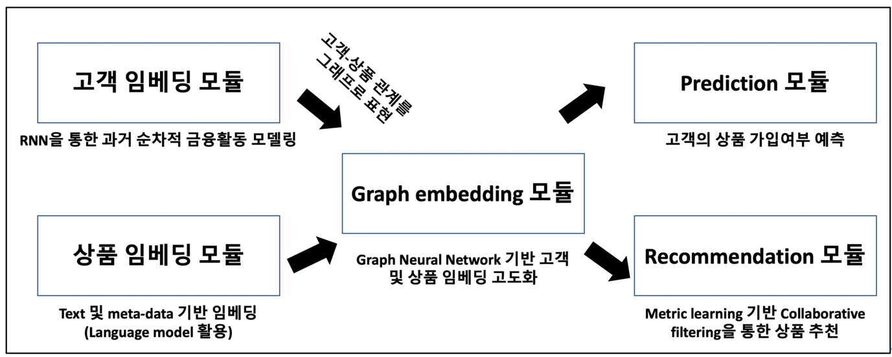

# RecSys_paper
implementation of Recommender System papers

## Matrix Factorization based
### Explicit Feedback
Implementation of Factorization Meets the Neighborhood: a Multifaceted Collaborative Filtering Model  
* [SVD(Singular Value Decomposition)](https://github.com/Namkyeong/RecSys_paper/blob/main/MatrixFactorization/SVD.ipynb)  
* [SVD++](https://github.com/Namkyeong/RecSys_paper/blob/main/MatrixFactorization/SVDpp.ipynb)  
* [Integrated version of SVD++ and neighborhood model](https://github.com/Namkyeong/RecSys_paper/blob/main/MatrixFactorization/SVD_integrated_v2.ipynb) (needs modification)  
  
  
Implementation of Probabilistic Matrix Factorization  
* [PMF](https://github.com/Namkyeong/RecSys_paper/blob/main/MatrixFactorization/pmf.ipynb)   
* [constrained_pmf](https://github.com/Namkyeong/RecSys_paper/blob/main/MatrixFactorization/constrained_pmf.ipynb)  
  

### Implicit Feedback
Implementation of OCCF (One Class Collaborative Filtering)
* [OCCF](https://github.com/Namkyeong/RecSys_paper/blob/main/MatrixFactorization/OCCF.ipynb)  
  
  
Implementation of Bayesian Personalized Ranking for Implicit Feedback
* [BPR](https://github.com/Namkyeong/RecSys_paper/blob/main/MatrixFactorization/BPRwithMF.ipynb)  

## models integrated with Multi Layer Perceptron
Implementation of Neural Collaborative Filtering
* [NeuMF](https://github.com/Namkyeong/RecSys_paper/blob/main/NeuralCollaborativeFiltering/NeuralCF.ipynb)  
  
Implementation of Collaborative Metric Learning
* [CML](https://github.com/Namkyeong/RecSys_paper/blob/main/CollaborativeMetricLearning/CML.ipynb)

Implementation of Wide&Deep Learning for Recommender Systems
* [Wide&Deep](https://github.com/Namkyeong/RecSys_paper/blob/main/Wide_Deep/Wide_Deep.ipynb)

## models with social relationship
Implementation of SoRec: Social Recommendation Using Probabilistic Matrix Factorization
* [SoRec](https://github.com/Namkyeong/RecSys_paper/blob/main/MatrixFactorization/SoRec.ipynb)
